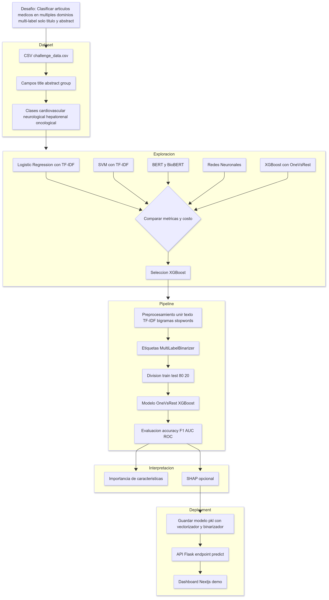

# Medical AI Dashboard - XGBoost Literature Classification


## Resúmen

Dashboard profesional para clasificación automática de literatura médica usando XGBoost. Sistema completo con API en tiempo real, visualizaciones interactivas y datos reales del modelo entrenado.



> Para una explicación detallada del proyecto, consulta el informe técnico: [docs/informe_final.pdf](docs/informe_final.pdf)

### Características 
- **4 Categorías Médicas:** Cardiovascular, Neurológico, Hepatorenal, Oncológico
- **Predicciones en Tiempo Real** con API Flask/Next.js
- **Visualizaciones Interactivas** con métricas de rendimiento
- **Datos Reales** del modelo entrenado (3,565 muestras)
- **Deployment Ready** para Vercel/GitHub Pages

## ¿Cómo ejecutar?

**Despliegue en producción:**
- **Frontend:** [https://ai-data-challenge.vercel.app/](https://ai-data-challenge.vercel.app/)
- **API Flask:** [https://ai-data-challenge-9e5b.onrender.com/api/health](https://ai-data-challenge-9e5b.onrender.com/api/health)

Puedes acceder al dashboard y API en producción usando los enlaces anteriores. Para desarrollo local, utiliza los endpoints locales.

## Mejor rendimiento alcanzado

| Métrica | Valor |
|---------|-------|
| **Accuracy** | 80.79% |
| **Precision (Macro)** | 97.02% |
| **Recall (Macro)** | 85.62% |
| **F1-Score (Macro)** | 90.78% |
| **ROC-AUC (Macro)** | 97.40% |
| **Muestras** | 3,565 |

### Rendimiento por Categoría

| Categoría | Precisión | Recall | F1-Score |
|-----------|-----------|--------|----------|
| **Cardiovascular** | 97.42% | 89.37% | 93.22% |
| **Neurológico** | 93.82% | 93.30% | 93.56% |
| **Hepatorenal** | 98.81% | 76.50% | 86.23% |
| **Oncológico** | 98.04% | 83.33% | 90.09% |

### Resultados de Cross-Validation

| Métrica | Valor Medio | Desviación Std |
|---------|------------|----------------|
| **Accuracy** | 74.86% | ±1.73% |
| **F1-Score (Macro)** | 87.67% | ±0.99% |
| **F1-Score (Micro)** | 88.43% | ±0.92% |

**Tiempo de entrenamiento:** 17 minutos, 15 segundos

## API Endpoints

La API Flask proporciona los siguientes endpoints para interactuar con el modelo:

### Health Check

```http
GET /api/health
```

Verifica el estado de la API y si el modelo está cargado correctamente.

**Respuesta:**
```json
{
  "status": "healthy",
  "model_loaded": true,
  "vectorizer_loaded": true,
  "timestamp": "2025-08-25T15:30:45.279319"
}
```

### Predicción

```http
POST /api/predict
```

Realiza una predicción de categorías médicas para un texto.

**Body:**
```json
{
  "text": "Adrenoleukodystrophy: survey of 303 cases: biochemistry, diagnosis, and therapy."
}
```

**Respuesta:**
```json
{
  "text": "Adrenoleukodystrophy: survey of 303 cases: biochemistry, diagnosis, and therapy.",
  "predictions": [
    {
      "category": "neurological",
      "probability": 0.92,
      "predicted": true,
      "confidence": "Alta"
    },
    {
      "category": "cardiovascular",
      "probability": 0.12,
      "predicted": false,
      "confidence": "Baja"
    },
    {
      "category": "hepatorenal",
      "probability": 0.08,
      "predicted": false,
      "confidence": "Baja"
    },
    {
      "category": "oncological",
      "probability": 0.03,
      "predicted": false,
      "confidence": "Baja"
    }
  ],
  "feature_importance": [
    {
      "feature": "adrenoleukodystrophy",
      "value": 1.0,
      "importance": 0.034
    }
  ],
  "prediction_summary": {
    "total_categories": 1,
    "max_probability": 0.92,
    "primary_category": "neurological"
  },
  "timestamp": "2025-08-25T15:31:12.456789"
}
```

### Información del Modelo

```http
GET /api/model-info
```

Obtiene información detallada sobre el modelo cargado.

**Respuesta:**
```json
{
  "model_type": "OneVsRestClassifier",
  "categories": ["cardiovascular", "neurological", "hepatorenal", "oncological"],
  "n_features": 5000,
  "model_params": {
    "n_estimators": 200,
    "max_depth": 8,
    "learning_rate": 0.05
  },
  "training_info": {
    "algorithm": "XGBoost",
    "task_type": "Multi-label Classification",
    "text_processing": "TF-IDF Vectorization"
  }
}
```

### Ejemplos de Demostración

```http
GET /api/demo-examples
```

Proporciona ejemplos predefinidos para probar el modelo.

### Estadísticas

```http
GET /api/statistics
```

Obtiene estadísticas detalladas del modelo y dataset, incluyendo métricas de rendimiento.

## Uso del Dashboard

El dashboard Next.js proporciona una interfaz intuitiva para:

1. **Predicciones en tiempo real**: Ingresar texto médico y ver resultados de clasificación
2. **Visualización de métricas**: Gráficos de rendimiento del modelo
3. **Ejemplos predefinidos**: Casos de prueba para demostración
4. **Explicabilidad**: Visualización de características importantes

## Estructura del proyecto

```
├── data/
│   └── challenge_data-18-ago.csv         # Dataset para entrenamiento
├── models/
│   └── xgboost_model.pkl                 # Modelo entrenado serializado
├── src/backend/results/
│   └── xgboost_results.json              # Resultados y métricas del modelo
├── logs/                                 # Logs de entrenamiento y ejecución
├── src/
│   ├── api/
│   │   └── api.py                        # API Flask para predicciones
│   ├── backend/
│   │   ├── config/
│   │   │   └── xgboost_config.py         # Configuraciones del modelo
│   │   ├── training/
│   │   │   └── xgboost_trainer.py        # Pipeline de entrenamiento
│   │   ├── models/
│   │   │   └── enhanced_xgboost.py       # Modelo XGBoost mejorado
│   │   └── evaluation/
│   │       └── xgboost_evaluator.py      # Evaluación y métricas
│   └── frontend/                         # Aplicación Next.js (Dashboard)
│       ├── app/                          # Estructura App Router de Next.js
│       │   ├── api/                      # API Routes de Next.js (solo frontend)
│       │   │   ├── demo-examples/        # Ejemplos de demostración
│       │   │   ├── health/               # Endpoint de estado
│       │   │   ├── predict/              # Endpoint de predicción
│       │   │   └── statistics/           # Endpoint de estadísticas
│       │   ├── page.tsx                  # Página principal del dashboard
│       │   └── layout.tsx                # Layout principal
│       ├── components/                   # Componentes React reutilizables
│       │   └── ui/                       # Componentes de interfaz 
│       ├── lib/                          # Utilidades y funciones auxiliares
│       └── public/                       # Archivos estáticos
├── run_xgboost_pipeline.py               # Script principal para entrenamiento y evaluación
├── start.sh                              # Script para iniciar API y frontend
└── requirements.txt                      # Dependencias del proyecto
```

**Despliegue en producción:**
- **Frontend (Next.js):** https://ai-data-challenge.vercel.app/
- **API Flask:** https://ai-data-challenge-9e5b.onrender.com/api/health

El frontend y backend están desplegados por separado. El dashboard Next.js consume la API Flask pública para predicciones y métricas.

# Uso del backend para manipular el modelo

### 1. Entrenar el Modelo

#### Entrenamiento básico:
```bash
python run_xgboost_pipeline.py train
```

#### Con configuración específica:
```bash
python run_xgboost_pipeline.py train --config high_performance
```

#### Con datos personalizados:
```bash
python run_xgboost_pipeline.py train --data-path data/mi_dataset.csv
```

#### Búsqueda de hiperparámetros:
```bash
python run_xgboost_pipeline.py train --hyperparameter-search
```

### 2. Evaluar el Modelo

```bash
python run_xgboost_pipeline.py evaluate --model-path models/xgboost_model.pkl
```

Con comparación baseline:
```bash
python run_xgboost_pipeline.py evaluate --model-path models/xgboost_model.pkl --baseline-results src/backend/results/baseline_results.json
```

### 3. Analizar el Modelo

#### Análisis de importancia de características:
```bash
python run_xgboost_pipeline.py analyze --model-path models/xgboost_model.pkl
```

#### Explicar predicción específica:
```bash
python run_xgboost_pipeline.py analyze --model-path models/xgboost_model.pkl --text "Patient presents with cardiovascular symptoms..."
```

#### Modo interactivo:
```bash
python run_xgboost_pipeline.py analyze --model-path models/xgboost_model.pkl --interactive
```

### 4. Comparar Configuraciones
```bash
python run_xgboost_pipeline.py compare-configs
```

## Configuraciones Disponibles

### `default`
- **Propósito**: Configuración balanceada para uso general
- **Estimadores**: 100
- **Profundidad**: 6
- **Learning Rate**: 0.1

### `fast_training`
- **Propósito**: Entrenamiento rápido para prototipado
- **Estimadores**: 50
- **Profundidad**: 4
- **Learning Rate**: 0.2

### `high_performance`
- **Propósito**: Máximo rendimiento (más lento)
- **Estimadores**: 200
- **Profundidad**: 8
- **Learning Rate**: 0.05
- **Subsample**: 0.8
- **Colsample Bytree**: 0.8
- **Reg Alpha**: 0.1
- **Early Stopping**: 15 rondas

### `regularized`
- **Propósito**: Control de overfitting
- **Regularización L1**: 0.5
- **Regularización L2**: 2.0
- **Gamma**: 0.1

## Características del Modelo XGBoost

```python
if XGBOOST_AVAILABLE:
    self.models['XGBoost'] = OneVsRestClassifier(
        XGBClassifier(
            random_state=42,
            n_estimators=200,
            max_depth=8,
            learning_rate=0.05,
            subsample=0.8,
            colsample_bytree=0.8,
            min_child_weight=1,
            gamma=0.0,
            reg_alpha=0.1,
            reg_lambda=1.0,
            eval_metric='logloss',
            early_stopping_rounds=15
        )
    )
```

### Ventajas de XGBoost:
- **Alto rendimiento**: Optimizado para velocidad y precisión
- **Regularización**: Control automático de overfitting
- **Manejo de missing values**: Automático
- **Feature importance**: Análisis detallado de características
- **Early stopping**: Previene sobreentrenamiento

## Salidas y Resultados

### Archivos generados durante entrenamiento:
- `src/backend/models/xgboost_model.pkl`: Modelo entrenado completo
- `src/backend/results/xgboost_results.json`: Métricas detalladas
- `src/backend/results/xgboost_training_YYYYMMDD_HHMMSS.log`: Log de entrenamiento

### Archivos generados durante evaluación:
- `src/backend/results/xgboost_comprehensive_evaluation.png`: Visualizaciones
- `src/backend/results/xgboost_detailed_evaluation.json`: Métricas detalladas
- `src/backend/results/xgboost_evaluation_summary.txt`: Resumen legible
- `src/backend/results/xgboost_feature_importance.png`: Importancia de características

### Archivos generados durante análisis:
- `src/backend/results/shap_explanation_[class].png`: Explicaciones SHAP
- `src/backend/results/xgboost_confusion_matrices.png`: Matrices de confusión

## Métricas Evaluadas

### Métricas básicas:
- **Accuracy**: Precisión general
- **F1-Score**: Macro, Micro, Weighted
- **Precision/Recall**: Macro, Micro
- **Hamming Loss**: Error en multi-label
- **Jaccard Score**: Similitud de conjuntos

### Métricas por clase:
- **AUC-ROC**: Área bajo curva ROC
- **Average Precision**: Área bajo curva PR
- **Support**: Número de muestras por clase

### Análisis multi-label:
- **Exact Match Ratio**: Predicciones perfectas
- **Label Ranking Loss**: Error de ranking
- **Frecuencia de etiquetas**: Distribución real vs predicha

## Uso Avanzado del Pipeline

La herramienta de línea de comandos `run_xgboost_pipeline.py` permite realizar diversas operaciones:

```bash
# Ver opciones disponibles
python run_xgboost_pipeline.py --help
```

### Entrenar con distintas configuraciones

```bash
# Configuración por defecto
python run_xgboost_pipeline.py train

# Configuración de alto rendimiento
python run_xgboost_pipeline.py train --config high_performance

# Búsqueda de hiperparámetros
python run_xgboost_pipeline.py train --hyperparameter-search
```

### Evaluación detallada

```bash
# Evaluación completa del modelo
python run_xgboost_pipeline.py evaluate --model-path models/xgboost_model.pkl

# Evaluación con datos específicos
python run_xgboost_pipeline.py evaluate --model-path models/xgboost_model.pkl --data-path data/custom_test_data.csv
```

### Explicabilidad

```bash
# Análisis SHAP para explicaciones
python run_xgboost_pipeline.py analyze --model-path models/xgboost_model.pkl --interactive
```

## Licencia

Este proyecto está bajo la licencia MIT. Ver archivo LICENSE para detalles.
